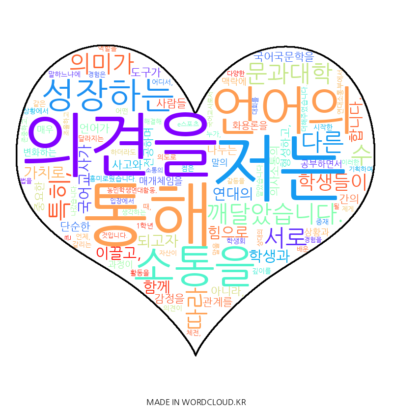

# Portfolio

저는 **언어의 힘**으로 소통을 이끌고, **연대의 가치**로 학생과 함께 성장하는 국어교사가 되고자 합니다. 

국어국문학을 전공하며 언어란 단순한 의사소통의 도구를 넘어, 사람들 사이의 관계를 형성하고 사고와 감정을 나누는 핵심적 매개체임을 깊이 깨달았습니다. 특히 **화용론**을 학습하며 말의 의미가 상황과 맥락에 따라 역동적으로 변화하는 과정에 매료되었습니다. 화자의 의도와 시간, 장소라는 맥락에 따라 같은 문장도 전혀 다른 무게를 지닌다는 점은 저에게 언어의 깊이와 신중함을 가르쳐 주었습니다.

이러한 학문적 깨달음은 대학 시절 학생회 활동을 통해 실천적 역량으로 확장되었습니다. 문과대학 학생회 연대소통부에서 활동하며 체전, 농민학생연대활동, e스포츠 대회 등 굵직한 행사를 기획했습니다. 다양한 이해관계가 얽힌 상황에서 저는 **중재자** 역할을 자처했습니다. 서로 다른 목소리를 조율하며 갈등을 해결하는 과정은 결코 쉽지 않았지만, **‘역지사지’의 자세**가 소통의 물꼬를 튼다는 사실을 배웠습니다. 진정한 소통은 유려한 언변이 아니라, 상대의 맥락을 깊이 이해하고 공감하려는 태도에서 시작된다는 것을 몸소 체험했습니다.

저는 교실이라는 공간에서 학생 개개인의 **고유한 목소리를 경청하는 교사**가 되고 싶습니다. 학생들이 자신의 생각을 자유롭게 표현하고, 국어를 통해 타인의 관점을 포용하며 사고의 지평을 넓힐 수 있는 환경을 조성하겠습니다. 지식 전달을 넘어, 학생들이 언어를 매개로 서로 연결되고 함께 성장하는 기쁨을 누리도록 돕는 것이 저의 간절한 꿈입니다. **소통의 진정성**을 바탕으로 학생들의 삶에 따뜻한 변화를 일으키는 국어교사가 되겠습니다.

